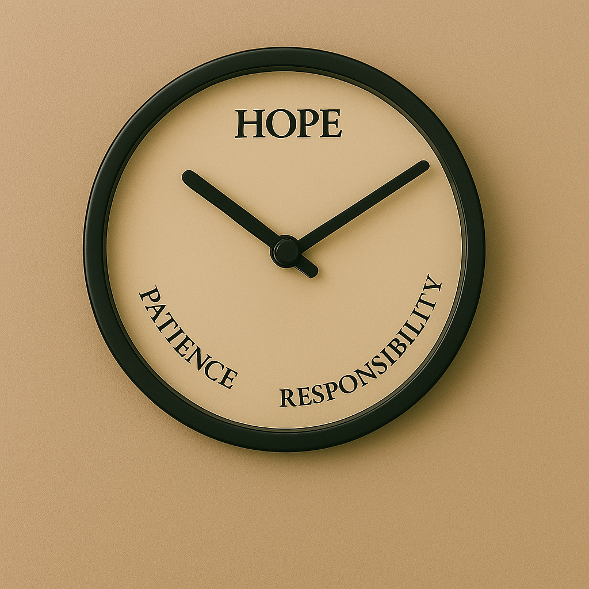

# Deep-Mind-Logical-System
A mental model combining logic, emotion, and light-based systems for human well-being.

.png)

## Overview

This repository contains the complete Deep Mind Logical System theory developed by **Ismail Irfan**. It presents a natural system of mental and emotional processing based on light, blood flow, eye movement, and logical recycling patterns. It aligns with the World Health Organization's definition of mental well-being and offers a new way of thinking about continuity, responsibility, and patience as the pillars of inner development.

---

## WHO’s Scientific Theory on Mental Health

According to the **World Health Organization (WHO)**:

> "Mental health is a state of well-being in which every individual realizes his or her own potential, can cope with normal stresses of life, can work productively and fruitfully, and is able to make a contribution to his or her community."

This theory expands on WHO's definition by applying emotional forces and logical operations rooted in natural and observable systems.

---

## Emotional Qualities and Logical Operations

### Three Emotional Forces:

1. **Hope** – Vision and belief that drives thoughts forward.
2. **Responsibility** – Ownership and meaningful connection of actions.
3. **Patience** – Control and calm during uncertainty.

### Three Logical Operations:

1. **Continuity** – Long-term thinking and memory.
2. **Break-up** – Resetting the mind during transitions.
3. **Relationship** – Linking thoughts and decisions for planning.

These are processed through eye movement and are influenced by how light enters the eye and blood circulates in response.

.png)
---

## Eye Movement and Mental Logic

* **Downward/Near Focus**: Activates Continuity.
* **Shifting Focus**: Activates Break-up.
* **Forward/Center Focus**: Activates Relationship.

This movement controls how light enters the eye and stimulates different logical operations.

.png)
---

## Light and Blood Circulation

* **Light**: Enters through the eyes and stimulates emotional and mental reactions.
* **Blood**: Carries emotional energy and responds to light and mental state.

The interaction between light and blood creates a feedback loop in mental processes.

.png)
---

## Light and Water Theory

### Sky to Earth (Light):

* Continuity: Flow of light in the sky
* Break-up: Reflected light from surfaces
* Relationship: Reflections connect sky and earth

### Earth to Sky (Water):

* Continuity: Rivers and seas
* Break-up: Water evaporating
* Relationship: Clouds returning as rain

These mirror how human memory and thought recycle.

---

## Programmatic Light Algorithms

To simulate this logic, the following algorithms are proposed:

### Main Recycle Algorithm

* **Action/Reaction** → Continuity
* **Reflection** → Break-up
* **Recycling** → Relationship

### Sub-Algorithms:

1. **Pattern**: Shadow creation when light hits an object = Initial thought formation
2. **Spectrum**: Reflections on water/mirror = Multiple versions of thought
3. **Algorithm**: Repeated light cycles = Process of refinement

**Universal Formula**:

> `Object + Quantity = Quality`

---

## Three-Words Keyboard

To simplify emotional processing:

* **My Desire** → Hope
* **My Selection** → Responsibility
* **My Choice** → Patience

This helps in reducing emotional confusion and enhances mindful communication.

View the keyboard: [https://ismailirfan.github.io/My-Keyboard/](https://ismailirfan.github.io/My-Keyboard/)

---

##Time Theory of Emotional Flow

Time-Based Emotional Adjustment Theory:

Suppose we want to adjust these three emotional elements—Hope, Patience, and Responsibility—within the framework of time. Let's imagine one hour divided equally into three 20-minute sections:

• **First 20 minutes: Hope** — We begin with hope, where the mind generates vision and motivation.

• **Next 20 minutes: Patience** — Once hope is formed, we enter a period of patience, allowing calm and stability.

• **Final 20 minutes: Responsibility** — With patience matured, we transition into responsibility, enabling us to take meaningful, guided action.

This cycle represents the internal clock of emotional growth and success. By following this structured emotional flow, we align our mental logic with natural timing—leading to more motivated hopes and sustainable achievement.

---
## Final Thought

> Quality is the main goal. Hope is the fuel.

Hope leads to patience.
Patience gives birth to responsibility.
Responsibility strengthens prayer and worship.
Worship strengthens hope and discipline.

This creates a recycling of human excellence — leading to belief, honesty, and success.

**"First impression is the last impression."**

**Quality is the impression.**

---

## License

This work is licensed under the **Creative Commons Attribution 4.0 International License (CC BY 4.0)**.

---

## Contributing

You are welcome to collaborate on this repository by:

* Opening discussions
* Submitting pull requests
* Translating content into your language

---

**Author:** Ismail Irfan
**GitHub:** [https://github.com/ismailirfan](https://github.com/ismailirfan)
